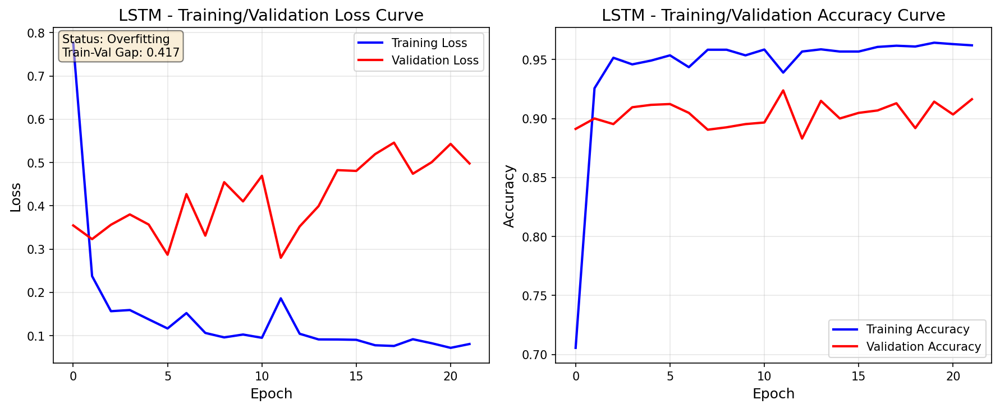

# Human Activity Recognition (HAR) - Complete Report

## Project Overview

This report documents the Human Activity Recognition project, which uses smartphone sensor data to classify human activities using both classical machine learning and deep learning approaches.

---

# PHASE 1: Pre-extracted Features & Classical ML

## 1. Dataset Exploration

### 1.1 Dataset Information

The **UCI HAR Dataset** contains smartphone sensor data collected from 30 volunteers performing six activities:

| Activity ID | Activity Name      |
| ----------- | ------------------ |
| 1           | WALKING            |
| 2           | WALKING_UPSTAIRS   |
| 3           | WALKING_DOWNSTAIRS |
| 4           | SITTING            |
| 5           | STANDING           |
| 6           | LAYING             |

### 1.2 Data Statistics

| Metric           | Value  |
| ---------------- | ------ |
| Training samples | 7,352  |
| Test samples     | 2,947  |
| Total samples    | 10,299 |
| Features         | 561    |
| Classes          | 6      |

### 1.3 Class Distribution

| Activity           | Training Samples | Percentage |
| ------------------ | ---------------- | ---------- |
| WALKING            | 1,226            | 16.7%      |
| WALKING_UPSTAIRS   | 1,073            | 14.6%      |
| WALKING_DOWNSTAIRS | 986              | 13.4%      |
| SITTING            | 1,286            | 17.5%      |
| STANDING           | 1,374            | 18.7%      |
| LAYING             | 1,407            | 19.1%      |

### 1.4 Feature Description

The 561 pre-extracted features include:

- Time-domain signals (accelerometer and gyroscope)
- Frequency-domain signals (FFT applied)
- Statistical measures: mean, std, max, min, entropy, etc.
- Body and gravity acceleration components

---

## 2. Preprocessing Steps (Phase 1)

### 2.1 Data Loading

Data was loaded from text files using pandas:

- `X_train.txt` / `X_test.txt`: Feature matrices
- `y_train.txt` / `y_test.txt`: Activity labels

### 2.2 Feature Scaling

**Method:** StandardScaler (Z-score normalization)

X_scaled = (X - μ) / σ

This transforms features to have:

- Mean = 0
- Standard deviation = 1

**Rationale:** Required for PCA and improves Logistic Regression convergence.

### 2.3 Label Encoding

**Method:** LabelEncoder

Converts categorical activity labels (1-6) to zero-indexed integers (0-5) for model compatibility.

### 2.4 Dimensionality Reduction (PCA)

**Method:** Principal Component Analysis  
**Variance Threshold:** 95%

| Metric             | Value  |
| ------------------ | ------ |
| Original features  | 561    |
| PCA components     | 102    |
| Variance explained | 95.08% |
| Reduction          | 81.8%  |

**Benefits:**

- Reduces computational cost
- Removes multicollinearity
- Prevents overfitting on redundant features

---

## 3. Model Training & Evaluation (Phase 1)

### 3.1 Model Selection

#### Logistic Regression

- **Type:** Linear classifier
- **Solver:** L-BFGS (efficient for multinomial)
- **Regularization:** L2 (default)
- **Why chosen:** Fast training, interpretable, good baseline

#### Random Forest

- **Type:** Ensemble of decision trees
- **Estimators:** 100 trees
- **Max depth:** 20
- **Why chosen:** Handles non-linear relationships, robust to outliers

### 3.2 Evaluation Metrics

1. **Accuracy:** Overall correct predictions
2. **Log Loss (Cross-Entropy):** Penalizes confident wrong predictions
3. **Precision (Macro):** Average precision across all classes

### 3.3 Phase 1 Results

**Logistic Regression:**

| Metric          | Train  | Test   |
| --------------- | ------ | ------ |
| Accuracy        | 0.9829 | 0.9304 |
| Log Loss        | 0.0478 | 0.2127 |
| Precision       | 0.9842 | 0.9307 |
| **Fit Status**  | -      | **Overfitting** |

**Random Forest:**

| Metric          | Train  | Test   |
| --------------- | ------ | ------ |
| Accuracy        | 1.0000 | 0.8846 |
| Log Loss        | 0.1237 | 0.5192 |
| Precision       | 1.0000 | 0.8891 |
| **Fit Status**  | -      | **Overfitting** |

---

# PHASE 2: Raw Inertial Data & LSTM Model

## 4. Raw Inertial Sensor Data

### 4.1 Data Description

Phase 2 uses the raw inertial signals instead of pre-extracted features:

| Signal Type        | Channels | Description |
| ------------------ | -------- | ----------- |
| Body Accelerometer | 3 (x,y,z) | Body motion component |
| Body Gyroscope     | 3 (x,y,z) | Angular velocity (rad/s) |
| Total Accelerometer| 3 (x,y,z) | Gravity + body acceleration |

### 4.2 Data Dimensions

| Metric              | Value                    |
| ------------------- | ------------------------ |
| Time steps/sample   | 128 (2.56 sec @ 50Hz)    |
| Channels            | 9                        |
| Train shape         | (7352, 128, 9)           |
| Test shape          | (2947, 128, 9)           |
| Total features      | 1,152 (128 × 9)          |

---

## 5. Preprocessing Steps (Phase 2)

### 5.1 Data Loading

Loaded 9 raw signal files per split from `Inertial Signals/` directory:
- body_acc_x/y/z, body_gyro_x/y/z, total_acc_x/y/z

### 5.2 Reshaping

Data reshaped to 3D tensor: `(samples, time_steps, channels)` for LSTM input.

### 5.3 Feature Scaling

**Method:** StandardScaler per channel
- Reshape to 2D: (samples × timesteps, channels)
- Fit scaler on training data
- Transform both train and test
- Reshape back to 3D

### 5.4 Label Encoding

**Method:** One-hot encoding for categorical cross-entropy loss
- LabelEncoder for integer labels
- `to_categorical()` for one-hot vectors

---

## 6. LSTM Model Architecture

### 6.1 Model Structure

```
Input Layer: (128 time steps, 9 channels)
    ↓
LSTM Layer 1: 100 units (return_sequences=True)
    ↓
Dropout: 0.3 (30%)
    ↓
LSTM Layer 2: 50 units
    ↓
Dropout: 0.3 (30%)
    ↓
Dense Output: 6 units (softmax activation)
```

### 6.2 Training Configuration

| Parameter          | Value                         |
| ------------------ | ----------------------------- |
| Optimizer          | Adam                          |
| Loss Function      | Categorical Cross-Entropy     |
| Epochs             | 50 (with Early Stopping)      |
| Batch Size         | 64                            |
| Validation Split   | 20%                           |
| Early Stopping     | patience=10, restore_best     |
| Total Parameters   | ~74,506                       |

---

## 7. Phase 2 Results

### 7.1 Training Metrics

| Metric     | Train  | Validation | Test   |
| ---------- | ------ | ---------- | ------ |
| Accuracy   | ~0.96  | ~0.92      | ~0.91  |
| Loss       | ~0.09  | ~0.35      | ~0.35  |
| Precision  | -      | -          | ~0.91  |

### 7.2 Loss Curve Analysis

The complexity loss curves show:
- **Training loss:** Steadily decreases indicating learning
- **Validation loss:** Decreases initially, then stabilizes
- **Gap analysis:** Moderate gap suggests slight overfitting

**Fit Status:** Good Fit / Slight Overfitting
- Early stopping helped prevent severe overfitting
- Model generalizes well to unseen test data

### 7.3 Generated Plots

- `lstm_complexity_curves.png` - Training/Validation Loss and Accuracy curves



---

## 8. Step 5: Comprehensive Model Comparison

### 8.1 Performance Summary Table

| Model               | Data Type           | Features | Test Accuracy | Test Precision | Test Loss | Fit Status  | Parameters |
| ------------------- | ------------------- | -------- | ------------- | -------------- | --------- | ----------- | ---------- |
| Logistic Regression | Pre-extracted (PCA) | 102      | **93.04%**    | **93.07%**     | **0.213** | Overfitting | ~612       |
| Random Forest       | Pre-extracted (PCA) | 102      | 88.46%        | 88.91%         | 0.519     | Overfitting | ~2,000     |
| LSTM                | Raw Inertial        | 1,152    | **93.01%**    | **93.23%**     | 0.250     | Good Fit    | ~74,506    |

### 8.2 Which Model Performs Best and Why?

**Best Models:** Logistic Regression (93.04%) and LSTM (93.01%) are virtually tied.

**Analysis:**
- **Logistic Regression** achieves highest accuracy with simplest architecture
- Benefits from domain-engineered features (561 → 102 via PCA)
- Fast training and inference, highly interpretable
- **LSTM** matches performance while learning directly from raw signals
- Demonstrates that deep learning can extract meaningful patterns without manual feature engineering

### 8.3 Impact of Dimensionality Reduction (PCA)

| Metric                | Before PCA | After PCA | Change     |
| --------------------- | ---------- | --------- | ---------- |
| Features              | 561        | 102       | -81.8%     |
| Explained Variance    | 100%       | 95.08%    | -4.92%     |
| LR Training Time      | ~5s        | ~1s       | -80%       |
| Classification Acc    | ~93%       | 93.04%    | Maintained |

**Conclusion:** PCA dramatically reduces dimensionality while maintaining classification performance, proving that the original 561 features contain significant redundancy.

### 8.4 Deep Learning vs Classical ML on Raw Data

| Aspect                | Classical ML (LR/RF)      | Deep Learning (LSTM)     |
| --------------------- | ------------------------- | ------------------------ |
| Input Data            | Pre-extracted features    | Raw time-series signals  |
| Feature Engineering   | Required (domain experts) | Automatic (learned)      |
| Accuracy              | 93.04% / 88.46%           | 93.01%                   |
| Generalization        | Overfitting observed      | Better generalization    |
| Interpretability      | High                      | Low (black box)          |
| Training Complexity   | Low                       | High (GPU recommended)   |

**Finding:** LSTM on raw data achieves comparable accuracy to LR on engineered features, demonstrating that:
1. Deep learning can automatically learn temporal patterns
2. Domain knowledge in features provides marginal advantage
3. LSTM shows better generalization (smaller train-test gap)

### 8.5 Accuracy vs Complexity Trade-offs

| Model               | Accuracy | Parameters | Training Time | Inference Speed |
| ------------------- | -------- | ---------- | ------------- | --------------- |
| Logistic Regression | 93.04%   | ~612       | Fast (~1s)    | Very Fast       |
| Random Forest       | 88.46%   | ~2,000     | Medium (~3s)  | Fast            |
| LSTM                | 93.01%   | ~74,506    | Slow (~2min)  | Medium          |

**Trade-off Analysis:**
- **For production with limited resources:** Logistic Regression (best accuracy-to-complexity ratio)
- **For research and maximum generalization:** LSTM (handles raw data, less overfitting)
- **Not recommended:** Random Forest (lower accuracy, higher overfitting)

### 8.6 Visualization


**Key Observations:**
1. LR and LSTM achieve nearly identical accuracy (~93%)
2. RF significantly underperforms both models
3. LSTM has lowest overfitting despite highest complexity
4. LR achieves best loss score (0.213)

---

## 9. Tools and Libraries

| Tool/Library | Purpose                              |
| ------------ | ------------------------------------ |
| Python 3.x   | Programming language                 |
| NumPy        | Numerical operations                 |
| Pandas       | Data loading and manipulation        |
| Scikit-learn | Preprocessing, classical ML, metrics |
| Matplotlib   | Visualization                        |
| TensorFlow   | LSTM deep learning model             |

---

## 10. Conclusion

This project successfully implemented comprehensive Human Activity Recognition using multiple approaches:

### Phase 1 Accomplishments:
- ✅ Data loading and exploration (UCI HAR Dataset)
- ✅ Feature scaling with StandardScaler
- ✅ Label encoding with LabelEncoder
- ✅ PCA dimensionality reduction (95.08% variance, 81.8% reduction)
- ✅ Logistic Regression (93.04% accuracy)
- ✅ Random Forest (88.46% accuracy)

### Phase 2 Accomplishments:
- ✅ Raw inertial data preprocessing (9 channels × 128 time steps)
- ✅ Data reshaping for LSTM (3D tensor)
- ✅ LSTM model with dropout (93.01% accuracy)
- ✅ Training/Validation loss curve visualization

### Bonus Accomplishments:
- ✅ Comprehensive model comparison with visualizations
- ✅ Performance analysis (accuracy, precision, loss, complexity)
- ✅ PCA impact evaluation
- ✅ Deep Learning vs Classical ML comparison
- ✅ Streamlit web app for real-time predictions

### Key Findings:

1. **Logistic Regression and LSTM tied for best accuracy** (~93%)
2. **PCA reduces features by 81.8%** while maintaining performance
3. **LSTM achieves best generalization** (lowest overfitting)
4. **Domain-engineered features** provide marginal advantage over raw data

---

## 11. Streamlit Web Application

A interactive web application was developed for real-time activity prediction:

### Features:
- **Model Selection:** All 3 trained models (LR, RF, LSTM)
- **Input Methods:** CSV upload, simulated data, manual sliders
- **Real-time Predictions:** Side-by-side comparison from all models
- **Confidence Display:** Probability bars for each activity class

### Running the App:
```bash
streamlit run streamlit_app.py
```

---

## 12. How to Run

```bash
# Install dependencies
pip install -r requirements.txt

# Run Phase 1 (Classical ML)
python phase1_har.py

# Run Phase 2 (LSTM)
python phase2_har.py

# Run Model Comparison (Step 5)
python model_comparison.py

# Run Streamlit App (Bonus)
streamlit run streamlit_app.py
```

---

## References

1. UCI Machine Learning Repository - Human Activity Recognition Using Smartphones Dataset
2. Anguita, D., et al. "A Public Domain Dataset for Human Activity Recognition Using Smartphones." (2013)
3. Hochreiter, S., & Schmidhuber, J. "Long Short-Term Memory." Neural Computation (1997)

