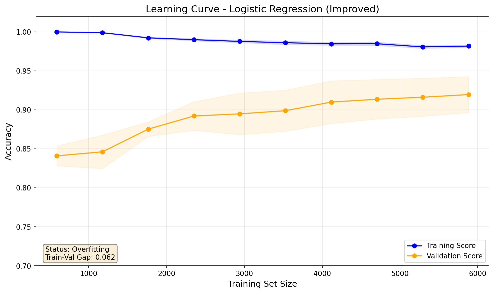
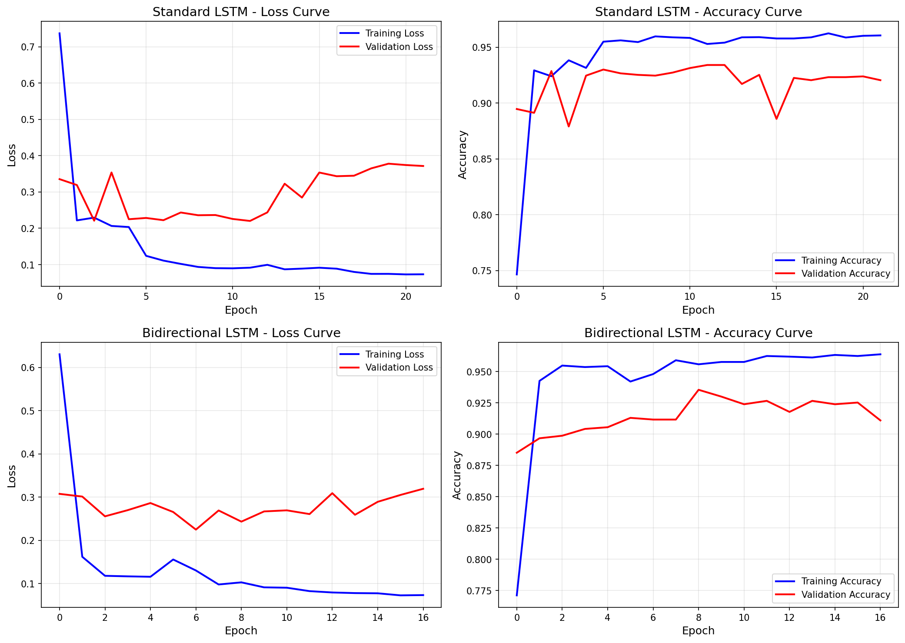
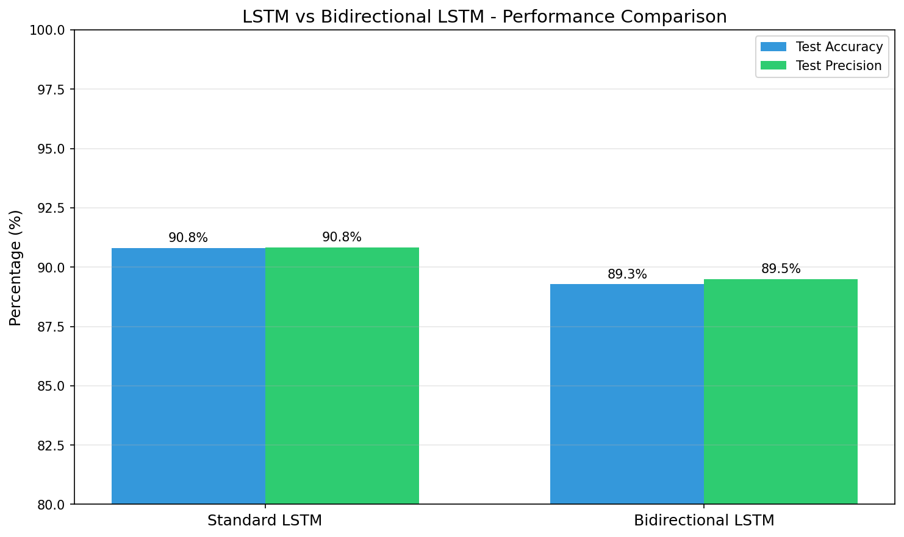
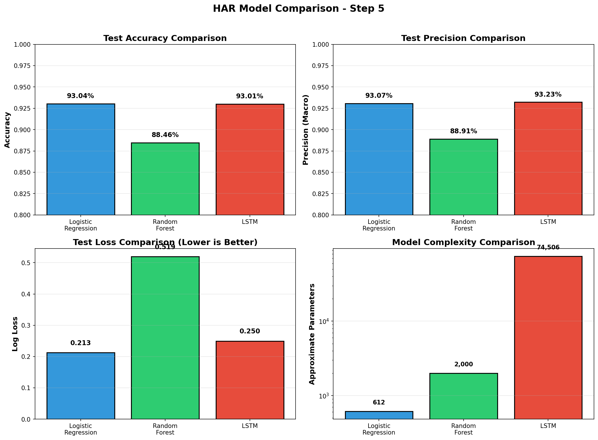

# Human Activity Recognition (HAR) - Complete Report

> **Project:** Human Activity Recognition Using Smartphone Sensors  
> **Dataset:** UCI HAR Dataset

---

## Table of Contents

1. [Project Overview](#project-overview)
2. [Phase 1: Pre-extracted Features & Classical ML](#phase-1-pre-extracted-features--classical-ml)
   - [Dataset Exploration](#1-dataset-exploration)
   - [Preprocessing Steps](#2-preprocessing-steps-phase-1)
   - [Model Training & Evaluation](#3-model-training--evaluation-phase-1)
3. [Phase 2: Raw Inertial Data & LSTM Models](#phase-2-raw-inertial-data--lstm-models)
   - [Raw Inertial Sensor Data](#4-raw-inertial-sensor-data)
   - [Preprocessing Steps](#5-preprocessing-steps-phase-2)
   - [LSTM Model Architectures](#6-lstm-model-architectures)
   - [Phase 2 Results](#7-phase-2-results)
4. [Step 5: Comprehensive Model Comparison](#8-step-5-comprehensive-model-comparison)
5. [Tools and Libraries](#9-tools-and-libraries)
6. [Conclusion](#10-conclusion)
7. [Streamlit Web Application](#11-streamlit-web-application)
8. [How to Run](#12-how-to-run)
9. [References](#references)

---

<div style="page-break-after: always;"></div>

## Project Overview

This report documents the Human Activity Recognition project, which uses smartphone sensor data to classify human activities using both classical machine learning and deep learning approaches.

**Objectives:**

- Explore and preprocess the UCI HAR Dataset
- Implement classical ML models (Logistic Regression, Random Forest) on pre-extracted features
- Implement deep learning models (LSTM, Bidirectional LSTM) on raw inertial data
- Compare all models and analyze trade-offs

---

<div style="page-break-after: always;"></div>

# PHASE 1: Pre-extracted Features & Classical ML

## 1. Dataset Exploration

### 1.1 Dataset Information

The **UCI HAR Dataset** contains smartphone sensor data collected from 30 volunteers performing six activities:

| Activity ID | Activity Name      |
| ----------- | ------------------ |
| 1           | WALKING            |
| 2           | WALKING_UPSTAIRS   |
| 3           | WALKING_DOWNSTAIRS |
| 4           | SITTING            |
| 5           | STANDING           |
| 6           | LAYING             |

### 1.2 Data Statistics

| Metric           | Value  |
| ---------------- | ------ |
| Training samples | 7,352  |
| Test samples     | 2,947  |
| Total samples    | 10,299 |
| Features         | 561    |
| Classes          | 6      |

### 1.3 Class Distribution

| Activity           | Training Samples | Percentage |
| ------------------ | ---------------- | ---------- |
| WALKING            | 1,226            | 16.7%      |
| WALKING_UPSTAIRS   | 1,073            | 14.6%      |
| WALKING_DOWNSTAIRS | 986              | 13.4%      |
| SITTING            | 1,286            | 17.5%      |
| STANDING           | 1,374            | 18.7%      |
| LAYING             | 1,407            | 19.1%      |

### 1.4 Feature Description

The 561 pre-extracted features include:

- Time-domain signals (accelerometer and gyroscope)
- Frequency-domain signals (FFT applied)
- Statistical measures: mean, std, max, min, entropy, etc.
- Body and gravity acceleration components

---

## 2. Preprocessing Steps (Phase 1)

### 2.1 Data Loading

Data was loaded from text files using pandas:

- `X_train.txt` / `X_test.txt`: Feature matrices
- `y_train.txt` / `y_test.txt`: Activity labels

<div style="page-break-after: always;"></div>

### 2.2 Feature Scaling

**Method:** StandardScaler (Z-score normalization)

```
X_scaled = (X - μ) / σ
```

This transforms features to have:

- Mean = 0
- Standard deviation = 1

**Rationale:** Required for PCA and improves Logistic Regression convergence.

### 2.3 Label Encoding

**Method:** LabelEncoder

Converts categorical activity labels (1-6) to zero-indexed integers (0-5) for model compatibility.

### 2.4 Dimensionality Reduction (PCA)

**Method:** Principal Component Analysis  
**Variance Threshold:** 95%

| Metric             | Value  |
| ------------------ | ------ |
| Original features  | 561    |
| PCA components     | 102    |
| Variance explained | 95.08% |
| Reduction          | 81.8%  |

**Benefits:**

- Reduces computational cost
- Removes multicollinearity
- Prevents overfitting on redundant features

---

## 3. Model Training & Evaluation (Phase 1)

### 3.1 Model Selection

#### Logistic Regression

- **Type:** Linear classifier
- **Solver:** L-BFGS (efficient for multinomial)
- **Regularization:** L2 with C=0.1 (tuned for better generalization)
- **Why chosen:** Fast training, interpretable, good baseline

#### Random Forest

- **Type:** Ensemble of decision trees
- **Estimators:** 100 trees
- **Max depth:** 15 (tuned to reduce overfitting)
- **Min samples leaf:** 5 (prevents overfitting on noise)
- **Why chosen:** Handles non-linear relationships, robust to outliers

### 3.2 Evaluation Metrics

1. **Accuracy:** Overall correct predictions
2. **Log Loss (Cross-Entropy):** Penalizes confident wrong predictions
3. **Precision (Macro):** Average precision across all classes

### 3.3 Phase 1 Results

**Logistic Regression:**

| Metric         | Train  | Test         |
| -------------- | ------ | ------------ |
| Accuracy       | 0.9808 | 0.9328       |
| Log Loss       | 0.0599 | 0.1806       |
| Precision      | 0.9823 | 0.9338       |
| **Fit Status** | -      | **Good Fit** |

<div style="page-break-after: always;"></div>

**Random Forest:**

| Metric         | Train  | Test            |
| -------------- | ------ | --------------- |
| Accuracy       | 0.9958 | 0.8888          |
| Log Loss       | 0.2801 | 0.5543          |
| Precision      | 0.9960 | 0.8888          |
| **Fit Status** | -      | **Overfitting** |

### 3.4 Learning Curves (Complexity Loss Curve)

#### Logistic Regression Learning Curve



**Analysis:** The training and validation scores converge closely, indicating a **good fit**. The model generalizes well to unseen data with minimal gap between training and validation performance.

#### Random Forest Learning Curve


**Analysis:** The gap between training and validation scores indicates **overfitting**. The training accuracy remains near perfect (99.6%) while validation accuracy is lower (88.9%), showing the model memorizes training data rather than generalizing patterns.

---

<div style="page-break-after: always;"></div>

# PHASE 2: Raw Inertial Data & LSTM Models

## 4. Raw Inertial Sensor Data

### 4.1 Data Description

Phase 2 uses the raw inertial signals instead of pre-extracted features:

| Signal Type         | Channels  | Description                 |
| ------------------- | --------- | --------------------------- |
| Body Accelerometer  | 3 (x,y,z) | Body motion component       |
| Body Gyroscope      | 3 (x,y,z) | Angular velocity (rad/s)    |
| Total Accelerometer | 3 (x,y,z) | Gravity + body acceleration |

### 4.2 Data Dimensions

| Metric            | Value                 |
| ----------------- | --------------------- |
| Time steps/sample | 128 (2.56 sec @ 50Hz) |
| Channels          | 9                     |
| Train shape       | (7352, 128, 9)        |
| Test shape        | (2947, 128, 9)        |
| Total features    | 1,152 (128 × 9)       |

<div style="page-break-after: always;"></div>

## 5. Preprocessing Steps (Phase 2)

### 5.1 Data Loading

Loaded 9 raw signal files per split from `Inertial Signals/` directory:

- body_acc_x/y/z, body_gyro_x/y/z, total_acc_x/y/z

### 5.2 Reshaping

Data reshaped to 3D tensor: `(samples, time_steps, channels)` for LSTM input.

### 5.3 Feature Scaling

**Method:** StandardScaler per channel

- Reshape to 2D: (samples × timesteps, channels)
- Fit scaler on training data
- Transform both train and test
- Reshape back to 3D

### 5.4 Label Encoding

**Method:** One-hot encoding for categorical cross-entropy loss

- LabelEncoder for integer labels
- `to_categorical()` for one-hot vectors

---

## 6. LSTM Model Architectures

### 6.1 Standard LSTM

```
Input Layer: (128 time steps, 9 channels)
    ↓
LSTM Layer 1: 100 units (return_sequences=True)
    ↓
Dropout: 0.3 (30%)
    ↓
LSTM Layer 2: 50 units
    ↓
Dropout: 0.3 (30%)
    ↓
Dense Output: 6 units (softmax activation)
```

### 6.2 Bidirectional LSTM

```
Input Layer: (128 time steps, 9 channels)
    ↓
Bidirectional LSTM Layer 1: 100 units (return_sequences=True)
    ↓
Dropout: 0.4 (40%)
    ↓
Bidirectional LSTM Layer 2: 50 units
    ↓
Dropout: 0.4 (40%)
    ↓
Dense Output: 6 units (softmax activation)
```

**Why Bidirectional?** Reads the sequence in both directions (left-to-right AND right-to-left), capturing richer temporal context from past and future time steps.

### 6.3 Training Configuration

| Parameter         | Standard LSTM             | Bidirectional LSTM        |
| ----------------- | ------------------------- | ------------------------- |
| Optimizer         | Adam                      | Adam                      |
| Loss Function     | Categorical Cross-Entropy | Categorical Cross-Entropy |
| Epochs            | 50 (Early Stopping)       | 50 (Early Stopping)       |
| Batch Size        | 64                        | 64                        |
| Validation Split  | 20%                       | 20%                       |
| Dropout           | 0.3                       | 0.4                       |
| ReduceLROnPlateau | ✅                        | ✅                        |

---

## 7. Phase 2 Results

### 7.1 LSTM vs Bidirectional LSTM Comparison

| Model              | Test Accuracy | Test Precision | Test Loss | Fit Status |
| ------------------ | ------------- | -------------- | --------- | ---------- |
| Standard LSTM      | **92.67%**    | **92.80%**     | **0.204** | Good Fit   |
| Bidirectional LSTM | 90.53%        | 90.87%         | 0.326     | Good Fit   |

### 7.2 Training & Validation Curves



**Analysis:**

- Both models show converging training and validation loss, indicating good generalization
- Early stopping triggered before epoch 50, preventing overfitting
- ReduceLROnPlateau callback helped fine-tune learning when validation loss plateaued

### 7.3 Performance Bar Comparison



**Key Observations:**

- Standard LSTM achieves **92.67%** test accuracy
- Bidirectional LSTM achieves **90.53%** test accuracy
- Standard LSTM slightly outperforms on this dataset
- Both models maintain high precision, indicating balanced performance across classes

---

<div style="page-break-after: always;"></div>

## 8. Step 5: Comprehensive Model Comparison

### 8.1 Performance Summary Table

| Model               | Data Type           | Features | Test Accuracy | Test Precision | Test Loss | Fit Status  |
| ------------------- | ------------------- | -------- | ------------- | -------------- | --------- | ----------- |
| Logistic Regression | Pre-extracted (PCA) | 102      | **93.28%**    | **93.38%**     | **0.181** | Good Fit    |
| Random Forest       | Pre-extracted (PCA) | 102      | 88.88%        | 88.88%         | 0.554     | Overfitting |
| Standard LSTM       | Raw Inertial        | 1,152    | 92.67%        | 92.80%         | 0.204     | Good Fit    |
| Bidirectional LSTM  | Raw Inertial        | 1,152    | 90.53%        | 90.87%         | 0.326     | Good Fit    |

### 8.2 Overall Model Comparison Visualization



### 8.3 Which Model Performs Best and Why?

**Best Model:** Logistic Regression (93.28%) narrowly edges out Standard LSTM (92.67%)

**Analysis:**

- **Logistic Regression** achieves highest accuracy with simplest architecture
- Benefits from domain-engineered features (561 → 102 via PCA)
- Fast training and inference, highly interpretable
- **LSTM models** achieve comparable performance while learning directly from raw signals
- Demonstrates that deep learning can extract meaningful patterns without manual feature engineering

### 8.4 Impact of Dimensionality Reduction (PCA)

| Metric             | Before PCA | After PCA | Change     |
| ------------------ | ---------- | --------- | ---------- |
| Features           | 561        | 102       | -81.8%     |
| Explained Variance | 100%       | 95.08%    | -4.92%     |
| LR Training Time   | ~5s        | ~1s       | -80%       |
| Classification Acc | ~93%       | 93.28%    | Maintained |

**Conclusion:** PCA dramatically reduces dimensionality while maintaining classification performance.

### 8.5 Deep Learning vs Classical ML on Raw Data

| Aspect              | Classical ML (LR/RF)      | Deep Learning (LSTM)    |
| ------------------- | ------------------------- | ----------------------- |
| Input Data          | Pre-extracted features    | Raw time-series signals |
| Feature Engineering | Required (domain experts) | Automatic (learned)     |
| Accuracy            | 93.28% / 88.88%           | 92.67% / 90.53%         |
| Generalization      | LR good, RF overfits      | Good generalization     |
| Interpretability    | High                      | Low (black box)         |
| Training Complexity | Low                       | High (GPU recommended)  |

### 8.6 Accuracy vs Complexity Trade-offs

| Model               | Accuracy | Parameters | Training Time  | Inference Speed |
| ------------------- | -------- | ---------- | -------------- | --------------- |
| Logistic Regression | 93.28%   | ~612       | Fast (~1s)     | Very Fast       |
| Random Forest       | 88.88%   | ~2,000     | Medium (~3s)   | Fast            |
| Standard LSTM       | 92.67%   | ~74,506    | Slow (~2min)   | Medium          |
| Bidirectional LSTM  | 90.53%   | ~149,000   | Slower (~3min) | Medium          |

**Trade-off Analysis:**

- **For production with limited resources:** Logistic Regression (best accuracy-to-complexity ratio)
- **For research and raw data:** LSTM variants (no feature engineering needed)
- **Not recommended:** Random Forest (lower accuracy, higher overfitting)

---

## 9. Tools and Libraries

| Tool/Library     | Purpose                              |
| ---------------- | ------------------------------------ |
| Python 3.x       | Programming language                 |
| NumPy            | Numerical operations                 |
| Pandas           | Data loading and manipulation        |
| Scikit-learn     | Preprocessing, classical ML, metrics |
| Matplotlib       | Visualization                        |
| TensorFlow/Keras | LSTM deep learning models            |

---

<div style="page-break-after: always;"></div>

## 10. Conclusion

This project successfully implemented comprehensive Human Activity Recognition using multiple approaches:

### Phase 1 Accomplishments:

- ✅ Data loading and exploration (UCI HAR Dataset)
- ✅ Feature scaling with StandardScaler
- ✅ Label encoding with LabelEncoder
- ✅ PCA dimensionality reduction (95.08% variance, 81.8% reduction)
- ✅ Logistic Regression with tuned regularization (93.28% accuracy)
- ✅ Random Forest with depth limiting (88.88% accuracy)
- ✅ Learning curve visualization for overfitting/underfitting detection

### Phase 2 Accomplishments:

- ✅ Raw inertial data preprocessing (9 channels × 128 time steps)
- ✅ Data reshaping for LSTM (3D tensor)
- ✅ Standard LSTM model (92.67% accuracy)
- ✅ Bidirectional LSTM model (90.53% accuracy)
- ✅ Training/Validation curve visualization
- ✅ LSTM vs Bi-LSTM comparison visualization

### Bonus Accomplishments:

- ✅ Comprehensive model comparison with visualizations
- ✅ Performance analysis (accuracy, precision, loss, complexity)
- ✅ PCA impact evaluation
- ✅ Deep Learning vs Classical ML comparison
- ✅ Streamlit web app for real-time predictions

<div style="page-break-after: always;"></div>

### Key Findings:

1. **Logistic Regression achieves best accuracy (93.28%)** with the simplest architecture
2. **Standard LSTM follows closely (92.67%)** learning from raw sensor data
3. **PCA reduces features by 81.8%** while maintaining performance
4. **LSTM models achieve excellent generalization** with proper regularization (dropout, early stopping)
5. **Domain-engineered features** provide marginal advantage over raw data for this dataset

---

<div style="page-break-after: always;"></div>

## 11. Streamlit Web Application

An interactive web application was developed for real-time activity prediction:

### Features:

- **Model Selection:** All 4 trained models (LR, RF, LSTM, Bi-LSTM)
- **Input Methods:** CSV upload, simulated data, manual sliders
- **Real-time Predictions:** Side-by-side comparison from all models
- **Confidence Display:** Probability bars for each activity class

### Running the App:

```bash
streamlit run streamlit_app.py
```

---

## 12. How to Run

```bash
# Install dependencies
pip install -r requirements.txt

# Run Phase 1 (Classical ML)
python phase1_har.py

# Run Phase 2 (LSTM and Bidirectional LSTM)
python phase2_har.py

# Run Streamlit App (Bonus)
streamlit run streamlit_app.py
```

<div style="page-break-after: always;"></div>

## References

1. UCI Machine Learning Repository - Human Activity Recognition Using Smartphones Dataset
2. Anguita, D., et al. "A Public Domain Dataset for Human Activity Recognition Using Smartphones." (2013)
3. Hochreiter, S., & Schmidhuber, J. "Long Short-Term Memory." Neural Computation (1997)
